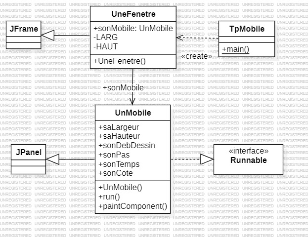
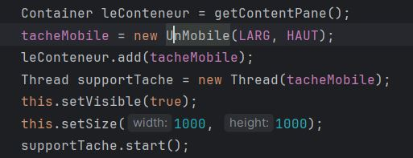
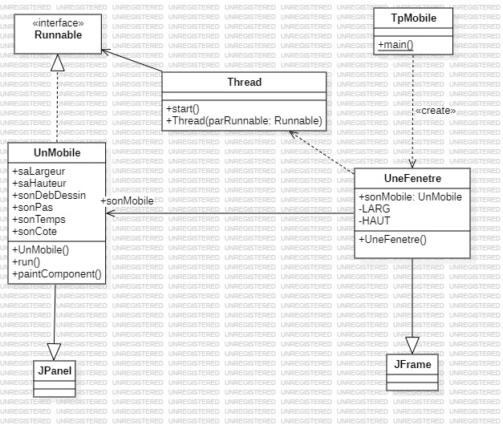
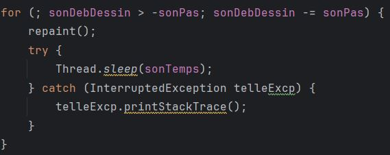
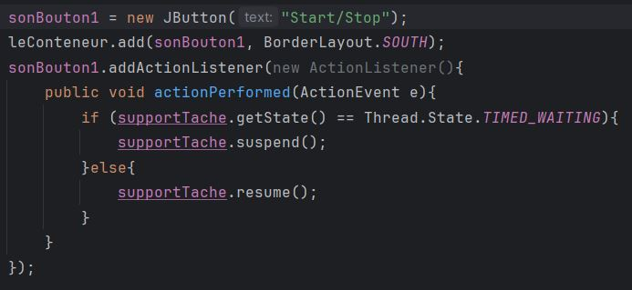
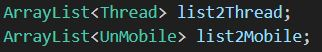
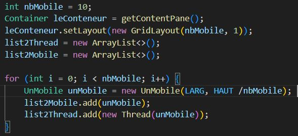
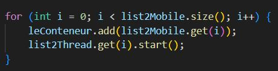
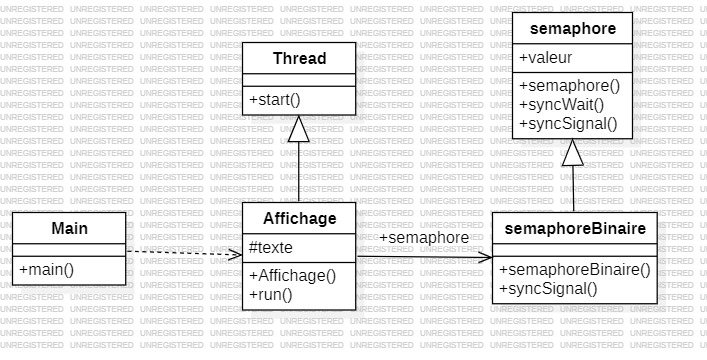

Enzo GUIGNOLLE

# Compte-Rendu des TPs

## TP1
### Première séance de TP (20/09)

Durant cette première séance de TP, nous devions travailler sur un code réalisé en Java qui permettait d'afficher une fenêtre et dans cette fenêtre un carré s'afficher et bougeait 
de la droite vers la gauche en utilisant la programmation répartie. Le code que nous avions pour commencer à travailler ressemblait à ce diagramme de classe UML :

Pour permettre de faire bouger le carré, mais en utilisant la programmation répartie. Nous devions alors faire un objet runnable donc sur ce code, c'est **UnMobile** qui a implanté l'interface Runnable et qui peut être exécuter par un thread. Après avoir créé cet objet Runnable, nous devons l'ajouter 
dans la fenêtre pour permettre de le voir se déplacer de ce fait, nous devions instancier l'objet dans le champ 
**sonMobile** de **UneFenetre** et ensuite de l'ajouter à la fenêtre une fois l'objet instancier.  
Ensuite, nous devions ajouter sonMobile à un thread pour qu'il puisse être executé. Et ensuite, nous devions start
le Thread pour qu'il puisse être lancé. Le code ajouté ressemblait à cela : 

### Deuxième séance de TP (27/09)

Dans cette deuxième séance de TP, nous devions ajouter la classe Thread dans le diagramme UML. Donc le diagramme UML
ressemble maintenant à cela : 

Nous devions aussi faire en sorte que sonMobile aille de droite à gauche après avoir atteint le bord de la fenêtre.
Pour faire cela, nous devions modifier la méthode run de la classe sonMobile en rajoutant une boucle où il part de l'endroit
où il touche le bord en enlevant sonPas. Donc maintenant la méthode run de sonMobile ressemble à ça :

Ensuite, nous devions faire en sorte de tester le cycle de vie d'un thread en mettant *en attente* et ensuite de le remettre *en execution* en appuyant sur un bouton. Donc pour réaliser cela, j'ai dû ajouter une petite partie de code qui permet de vérifier l'état du thread pour savoir s'il est *en exécution* ou *en attente*.  
Voici ce que j'ai fait :

Donc j'ai dû récupéré l'état du thread pour vérifier qu'il soit bien en exécution. Cependant par le faite que dans les boucles de la méthode run
de l'utilisation de *Thread.sleep*, l'état du thread que j'ai dû récupérer est *TIMED_WAITING* qui est un état en java où le thread attend pour une durée determiné la suite de ces instructions. Quand nous étions à l'IUT, j'avais tester et cela ne marchait pas et cela me mettait une erreur donc j'ai voulu tester de réglé le problème de mon coté sur mon ordinateur. Et mon code a marché sans que je comprenne pourquoi et en réfléchissant j'ai découvert que l'IUT avais la dernière version de Java et par conséquent nous ne pouvions plus utilisé ces méthode dans la version 22 de Java puisque sur mon ordinateur j'ai une version plus vielle.

### Troisième séance de TP (04/10)

Durant cette troisième séance de TP, nous devions réfléchir à faire marcher le suspend et resume dans la version 22 de Java. Donc pour cela nous pouvions mettre suspend
dans la méthode run de la classe UnMobile. Mais nous ne pouvions pas faire de resume car le thread n'était plus en activité. 
Ensuite nous devions faire en sorte que plusieurs mobile soit sur la fenêtre et bouge en même temps et pas à la même vitesse. Donc pour réalisé cela j'ai dû modifier le code de cette façon : 

J'ai commencé par ajouter deux liste pour enregistrer chaque mobile et chaque thread associé à chaque mobile

Ensuite j'ai créé chaque mobile et associé chaque mobile à un thread distinct et je les ajoute chacun dans leur liste respectif et change aussi le layout de la fenêtre en la mettant en grille.

Et je finis par faire une boucle pour ajouter chaque mobile à la fenêtre et mettre en exécution chaque thread de chaque mobile.

 
 

Dans la deuxième partie de la séance nous devions travailler sur le TP 2 qui permet de jouer avec des mots et les afficher dans le bonne ordre et eviter que des mots se chevauche. Le code sur lequel nous devions travailler ressemble à cela : 

  

Donc dans ce code nous avons deux thread qui sont indépendant l'un de l'autre et qui veulent accéder à la même ressource critique. Donc pour pouvoir éviter qu'ils y accèdent en même temps nous devons déterminer la section critique que nous allons devoir synchroniser pour que chacun son tour ils y accèdent. Pour ce code, la section critique est la boucle for de la méthode run de la classe Affichage puisque la ressource que chaque Thread veut accéder est *System.out*. 
Pour pouvoir les synchroniser nous avons deux méthodes, la première méthode est de mettre le mot-clé *synchronised* avec soit entre parenthèse une classe vide ou alors de mettre la ressources critique qu'il veulent accéder donc là *System.out*.  
La deuxième méthode est l'utilisation d'un sémaphore. Pour cela nous avions un code donné dont je vais décrire son fonctionnement. Avant de décrire sont fonctionnement, un sémaphote utilise 2 méthodes qui sont la méthode Wait() pour faire patienter un ou plusieurs thread(s) si un thread est déjà dans la section critique. La deuxième méthode est la méthode Signal() qui permet d'avertir le thread qui est dans la section critique libère l'accès à la ressource à un thread. Donc pour réaliser un sémaphore la section critique commence toujours par un Wait et finit toujours pas un Signal.
 
Maintenant je vais décrire les différentes classe pour réaliser un sémaphore binaire. Donc tout d'abord nous avons la classe semaphoreBinaire qui hérite de la classe semaphore, elle possède son constructeur et la méthode *syncSignal()*. Dans le constructeur de la classe, on doit mettre en paramètre une valeur initial qui est soit 0 soit différent de 0 ensuite elle le donne à la classe mère sémaphore, en fonction de si c'est 0 ou pas, j'expliquerai son fonctionnement ci-après. Dans la méthode syncSignal(), elle appel la méthode syncSignal de la classe mère et si la valeur est supérieur à 1 elle met la valeur à 1.
 
Maintenant dans la classe semaphore, nous avons le constructeur de la classe et deux méthode qui sont syncWait() et syncSignal(). Dans le constructeur nous allons mettre dans la valeur qui est un champ de la classe, la valeur initial rentrée en paramètre donc dans ce cas là, la valeur initial envoyer par la classe semaphoreBinaire.  
Dans la méthode syncWait(), nous avons une boucle while qui vérifie si la valeur qui est dans le champ de la classe est inférieur et égal à 0 donc si on mets la valeur à 1 le premier thread ne rentre pas dans la boucle while et les autres thread y seront tant que l'autre thread n'aura pas terminé ce qu'il a à faire. Cependant si la valeur donné au début est 0 tout les thread seront dans la boucle while et ne sortiront jamais de la boucle. Après quand un thread n'est plus dans la boucle, on enlève -1 à la boucle.  
Dans la méthode syncSignal(), on commence par ajouter +1 à la valeur en champ et il préviens les autres threads que la place est libre.

### Quatrième séance de TP (11/10)

Durant la première partie de cette quatrième séance, nous avons dû retourner sur le TP 1 et faire en sorte de séparé la fenêtre en 3 parties où les mobiles se trouvent et que dans la partie centrale de la fenêtre un certains nombre de mobile on le droit de passé en même temps dès que la limite de mobile dans la zone est atteint, les autres mobiles qui veulent rentrer dedans doivent attendre qu'un mobile sorte.  
Pour réalisé cela nous avons dû reprendre la classe Cemaphore du TP2 et créer une classe CemaphoreGen pour permettre de sécurisé la section critique qui est la zone ou un certains nombre de mobile à le droit de passé en même temps.  
Voici la classe CemaphoreGen :

  
Après avoir récupérer la classe Cemaphore et créer la classe CemaphoreGen, nous avons dû modifier la méthode run de la classe UnMobile en mettant 6 boucles différentes en ayant 3 pour l'allée et 3 pour le retour avec la deuxième boucle pour l'aller et pour le retour qu'on délimite avec le semaphore pour bloquer le nombre de mobile. 
En deuxième partie de séance nous avons commencer le cours et le TP3 sur les moniteurs. Dans ce TP nous devons réalisé une boite au lettre c'est-à-dire qu'il y a une classe BAL, une classe Facteur et une classe Habitant, le Facteur peut mettre un lettre dans la BAL si elle est vide et l'habitant peut récupérer la lettre dans la bal si elle n'est pas vide. 
Pour réalisé cela j'ai dû faire une classe BAL, voici ce qu'il y a dedans : 

J'ai ensuite du réaliser une classe Facteur pour mettre une lettre dans la classe BAL, voici comment j'ai réalisé cela : 

Pour finir, j'ai dû réaliser une classe Habitant pour récupérer la lettre mise dans la classe BAL, voici comment j'ai réalisé cela : 

### Cinquième séance de TP (18/10)

